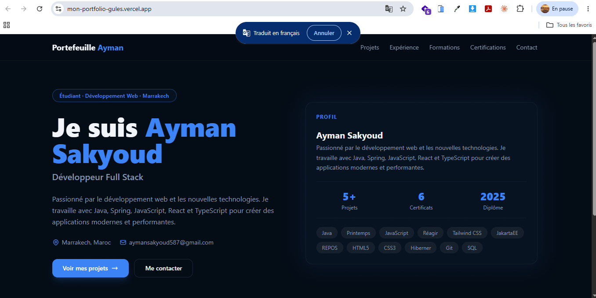
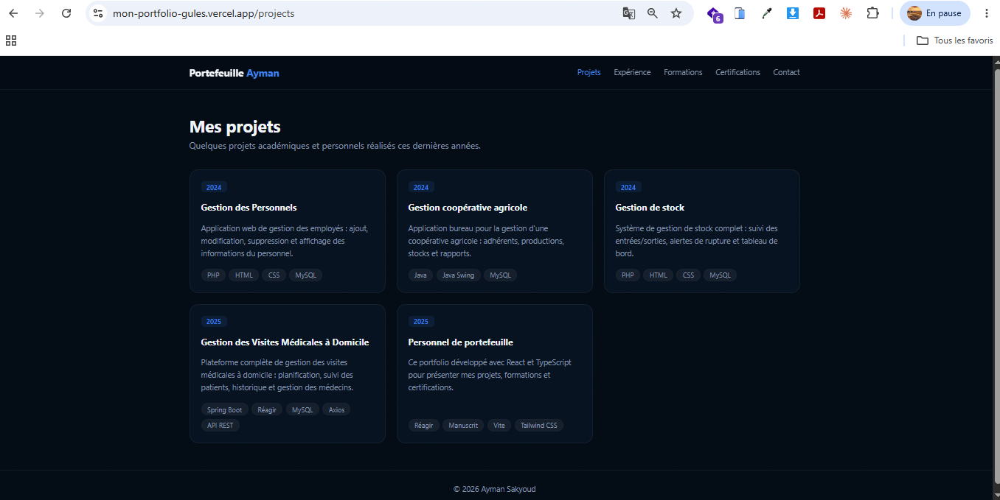
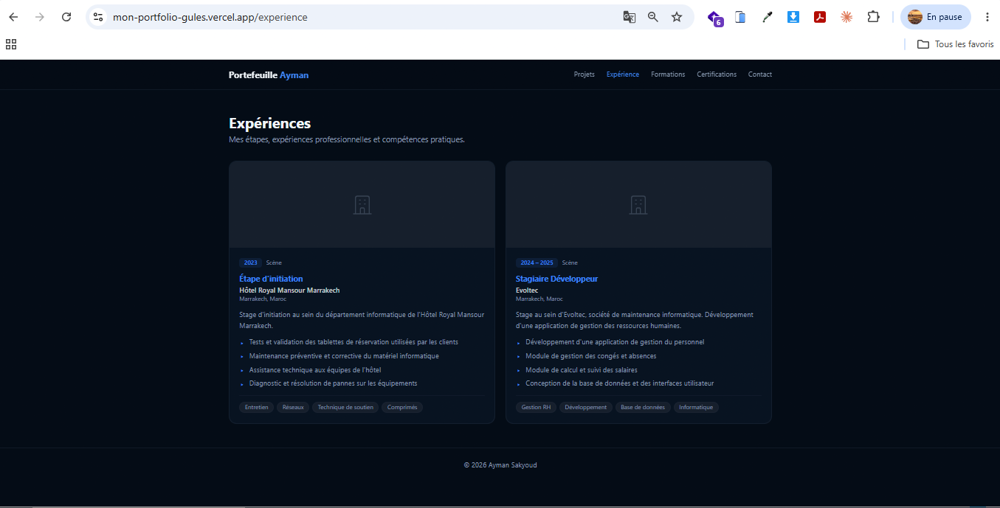
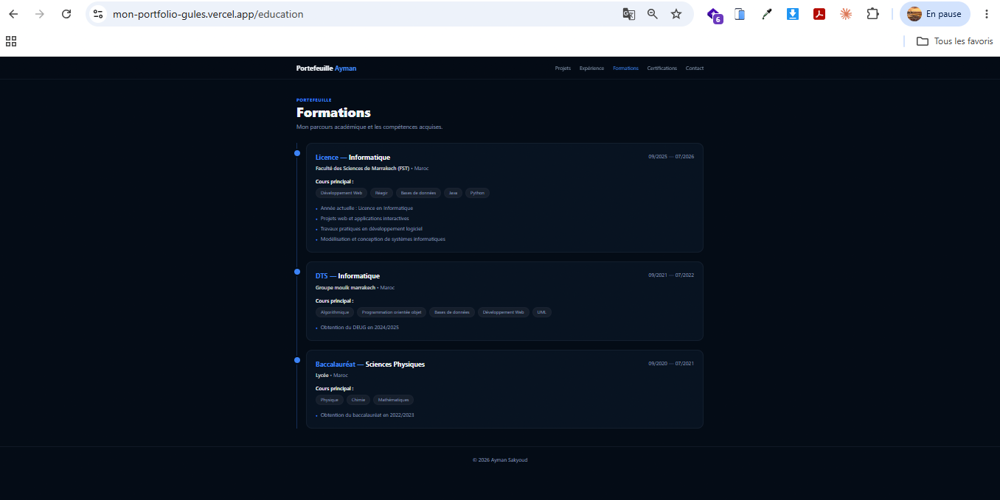
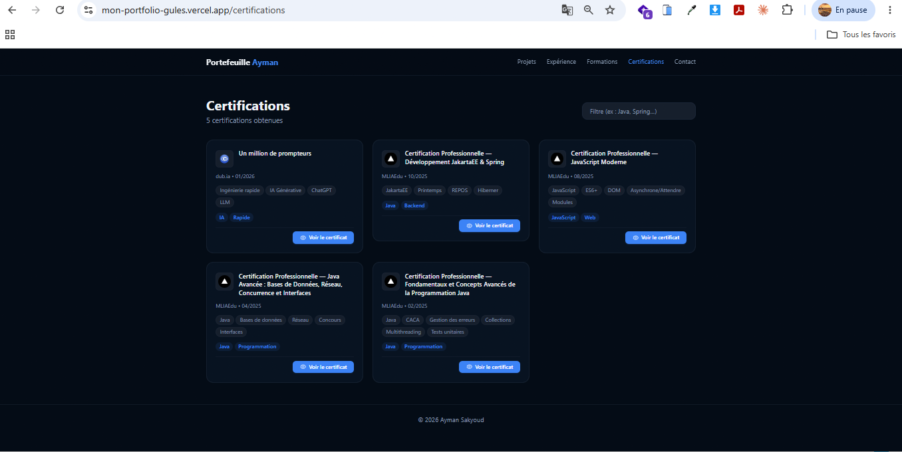
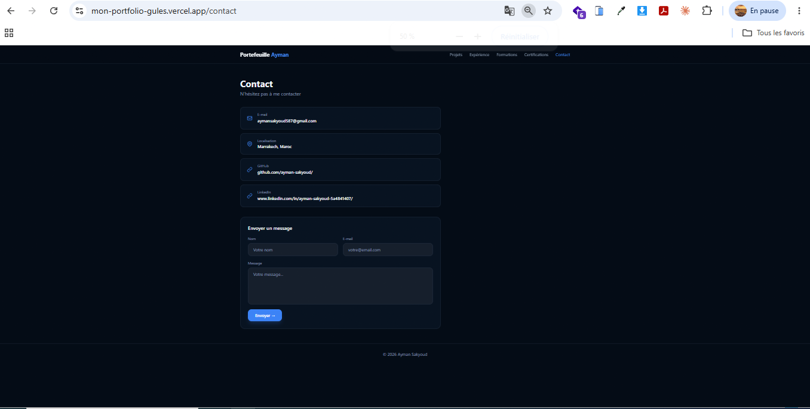

# 🚀 Portfolio React Pro

Un portfolio moderne, responsive et performant développé avec **React**, **Vite** et **TypeScript**. Ce projet présente un design professionnel, des animations fluides et une architecture propre adaptée aux bonnes pratiques du développement Front-End.

---

## 📸 Aperçu

### Page d'accueil



### À propos



### Compétences



### Projets



### Expérience



### Contact



---

# ✨ Fonctionnalités

- 🎨 Interface moderne et responsive
- ⚡ Développé avec Vite pour des performances optimales
- 📱 Compatible Mobile, Tablette et Desktop
- 🌙 Design professionnel
- ✨ Animations fluides
- 📂 Présentation des projets
- 👤 Section À propos
- 💼 Présentation des compétences
- 📧 Formulaire de contact
- 🔥 Code organisé et facilement maintenable

---

# 🛠️ Technologies utilisées

| Technologie | Version |
|-------------|----------|
| React | 19+ |
| TypeScript | 5+ |
| Vite | 7+ |
| Tailwind CSS | 4+ |
| React Router | Dernière version |
| ESLint | Dernière version |
| Prettier | Dernière version |

---

# 📁 Structure du projet

```
portfolio-react/
│
├── public/
│
├── src/
│   ├── assets/
│   ├── components/
│   ├── layouts/
│   ├── pages/
│   ├── hooks/
│   ├── services/
│   ├── styles/
│   ├── types/
│   ├── utils/
│   ├── App.tsx
│   └── main.tsx
│
├── screenshots/
│
├── package.json
├── tsconfig.json
├── vite.config.ts
└── README.md
```

---

# ⚙️ Installation

## 1. Cloner le projet

```bash
git clone https://github.com/votre-utilisateur/portfolio-react.git
```

---

## 2. Accéder au dossier

```bash
cd portfolio-react
```

---

## 3. Installer les dépendances

```bash
npm install
```

---

## 4. Lancer le serveur

```bash
npm run dev
```

---

## 5. Construire le projet

```bash
npm run build
```

---

## 6. Prévisualiser la version de production

```bash
npm run preview
```

---

# 📜 Scripts disponibles

| Commande | Description |
|----------|-------------|
| npm run dev | Lance le serveur de développement |
| npm run build | Génère la version de production |
| npm run preview | Prévisualise le build |
| npm run lint | Analyse le code avec ESLint |
| npm run format | Formate le code avec Prettier |

---

# 🎯 Bonnes pratiques appliquées

- Architecture modulaire
- Composants réutilisables
- TypeScript strict
- Responsive Design
- Lazy Loading
- Code splitting
- Optimisation des performances
- Accessibilité (A11Y)
- Organisation claire des fichiers

---

# 📱 Responsive Design

Le portfolio est optimisé pour :

- 💻 Desktop
- 💼 Laptop
- 📱 Mobile
- 📲 Tablette

---

# 🚀 Performance

- Chargement rapide grâce à Vite
- Bundle optimisé
- Images optimisées
- Code splitting
- Lazy loading

---

# 📄 Licence

Ce projet est distribué sous la licence MIT.

Vous êtes libre de l'utiliser, de le modifier et de le distribuer.

---

# 👨‍💻 Auteur

**Sakyoud Ayman**

Développeur Front-End

- Portfolio :https://mon-portfolio-gules.vercel.app/
- GitHub : https://github.com/ayman-sakyoud/
- LinkedIn :www.linkedin.com/in/ayman-sakyoud-5a4841407/
- Email : aymansakyoud587@email.com

---

<div align="center">

### ⭐ Si ce projet vous a plu, pensez à lui laisser une étoile !

Made with ❤️ using React + Vite + TypeScript

</div>
